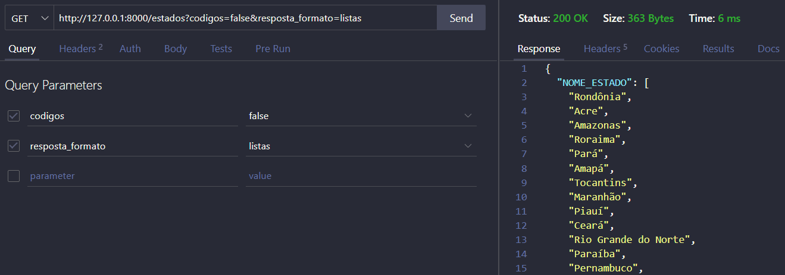
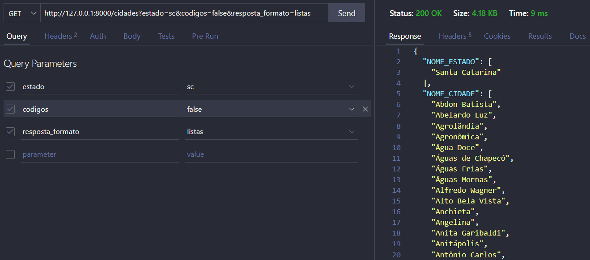
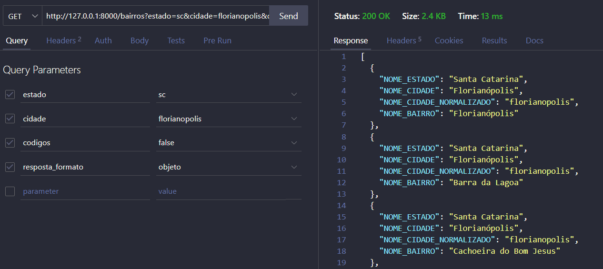
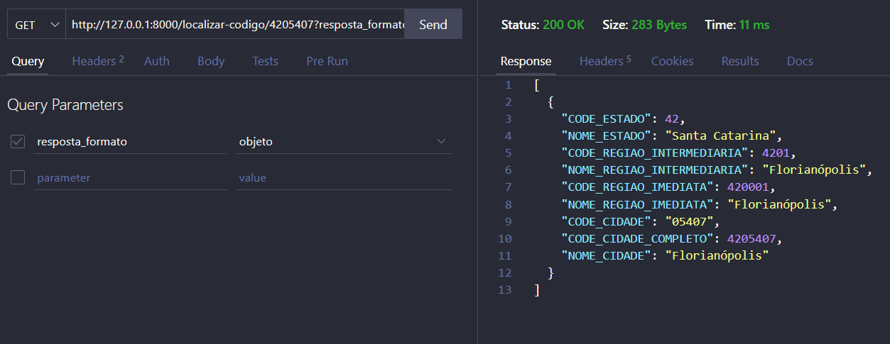
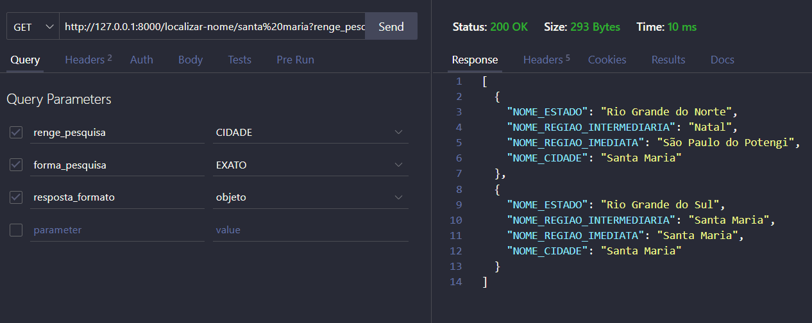

# 📍 Brasil GeoAPI

**Brasil GeoAPI** é uma API desenvolvida em **Python** utilizando **FastAPI** e **Pandas**, que fornece dados geográficos do Brasil.  
Com ela, é possível consultar estados, cidades, bairros, traduzir códigos do IBGE em localizações, além de buscar nomes para encontrar locais correspondentes.

➡️ **[Acesse a API Online](https://api-geografia-brasil.onrender.com/docs)** *(pode levar alguns segundos para o servidor iniciar)*

---

## 🚀 Funcionalidades

✅ Listar todos os **estados** do Brasil  
✅ Listar **cidades** de um estado  
✅ Listar **bairros** de uma cidade  
✅ Traduzir **códigos IBGE** para localizações exp: 42 -> Santa Catarina   
✅ Buscar por **nomes** para ver possíveis locais correspondentes     
    exp: pesquisando o nome **Santa Maria** na opcao de cidades vai retornar que tem duas cidades com esse nome uma em Rio Grande do Norte e a outra no Rio Grande do Sul    
✅ Traduzir coordenadas *(latitude e longitude)* para estado, regions e cidade          
    exp: LATITUDE: -27.5777, LONGITUDE: -48.5081 -> Estado: SC, Cidade: Florianópolis     
✅ Traduzir localização *(estado e cidade)* para coordenadas *(latitude e longitude)*     
    exp: Estado: SC, Cidade: Florianópolis -> LATITUDE: -27.5777, LONGITUDE: -48.5081      
✅ Traduzir codigo do IBGE para cordenadas *(latitude e longitude)*        
    exp: 4205407 -> LATITUDE: -27.5777, LONGITUDE: -48.5081    

---

## 🛠️ Principais Tecnologias utilizadas

- [Python] Linguagem de programaçao
- [FastAPI] Fazer o Back End
- [Pandas] Trabalhar com os dados
- [Uvicorn] para rodar o servidor

---

## 📂 Estrutura do projeto
app/  
├── main.py # Inicializa a API FastAPI  
├── obterDados.py # Processa os dados brutos do IBGE  
├── api/ # Rotas da API  
├── core/ # Constantes, schemas e configs  
├── data/ # Dados em Parquet  
├── services/ # Serviços e funções auxiliares  
└── requirements.txt # Dependências do projeto  


## 📊 Rotas


### GET /estados


### GET /cidades


### GET /bairros


### GET /localizar-codigo/{codigo}


### GET /localizar-nome/{nome}


---

## ▶️ Como rodar o projeto localmente

Clone o repositório
```bash
https://github.com/Thiago-Weiss/Projeto-api-cidades.git
```
Crie o ambiente virtual do Python
```bash
python -m venv venv
source venv/bin/activate   # Linux/Mac
venv\Scripts\activate      # Windows
```
Instale as dependencias
```bash
pip install -r requirements.txt
```
Rode o servidor
```bash
uvicorn app.main:app --reload
ou
python -m uvicorn app.main:app --reload
```
Acesse a api
```bash
http://127.0.0.1:8000/docs
```


📜 Licença
Este projeto está sob a licença MIT. Você pode usá-lo, modificá-lo e distribuí-lo livremente.

